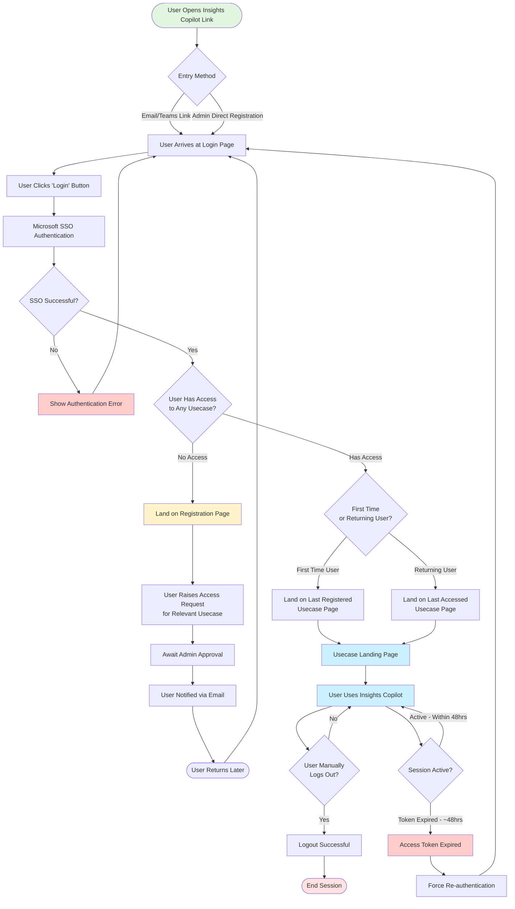

# Insights Copilot User Login Flow

## Flow Description

### Happy Path Flow
1. **Entry**:  User opens Insights Copilot via email/Teams link or after admin registration
2. **Login**:  User clicks "Login" button on login page
3. **Authentication**: User completes Microsoft SSO authentication successfully
4. **Access Check**: System verifies user has access to at least one usecase
5. **Landing**: User lands on appropriate page (last accessed for returning users, last registered for first-time users)
6. **Usage**: User successfully uses Insights Copilot

### Unhappy Path - No Access
1. **Entry → Authentication**: Same as happy path (steps 1-3)
2. **No Access Detected**: System finds user has no usecase access
3. **Registration Page**: User redirected to registration page
4. **Request Access**: User raises access request for relevant usecase
5. **Awaiting Approval**: Request pending admin approval
6. **Return**:  User notified and returns later to login again

### Relogin Flow (Token Expiration)
1. **Active Session**: User actively using Insights Copilot
2. **Token Expiry**: After ~48 hours, access token expires
3. **Force Relogin**: System forces re-authentication
4. **Back to Login**: User redirected to login page
5. **Repeat Flow**: User goes through authentication flow again

### Edge Cases Covered
- **SSO Authentication Failure**: User returned to login page with error
- **Manual Logout**: User can manually end session
- **Unknown User**:  Directed to registration page (no access path)
- **Multiple Usecases**: System determines correct landing page based on user history