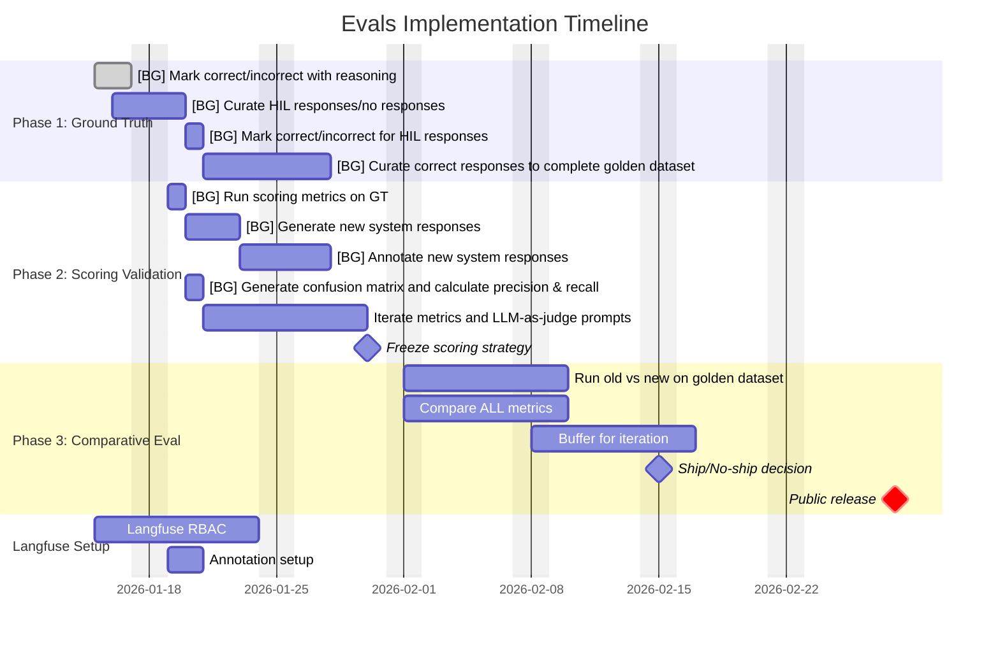
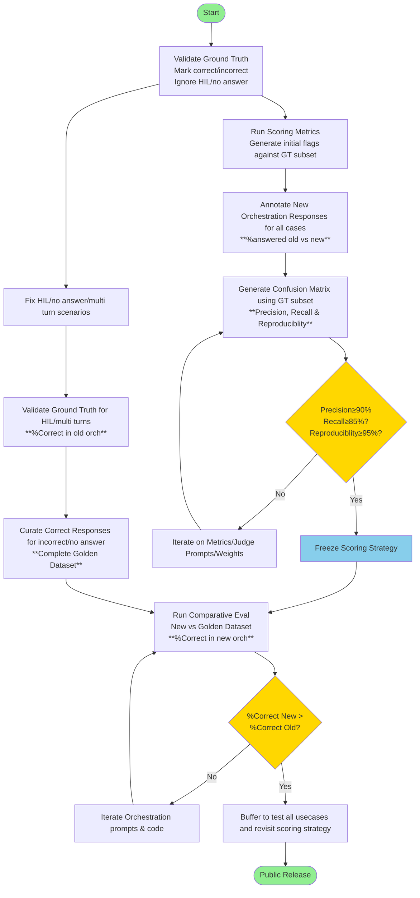

# Evals Implementation Plan

## Objective

Build confidence to ship orchestration changes faster with objective, data-driven validation. **Merge gate: New orchestration must beat old system on ALL metrics** measured via weighted composite scoring validated against human-annotated ground truth.

## Success Criteria

### Primary Goal

**100% of prompt and code changes validated as improvement before merge** using automated evals. The automate evals should match human judgment at:

- **Precision: ≥90%** (eval says "correct" → human agrees it's correct)
- **Recall: ≥85%** (human says "correct" → eval catches it as correct)

### Merge Gate

New orchestration must achieve **higher composite score than old system** where composite score = weighted average of:

- **Accuracy** (factual correctness)
- **Relevance** (answers the question asked)
- **Coherence** (logical, well-structured response)
- **Completeness** (addresses all aspects of query)

### Non-Goals

- Automating ground truth creation (too risky - garbage in, garbage out)

---

## Validation Methodology

### Ground Truth Annotation (Human-First Approach)

**Pilot Usecase: Brand Guidance**

- Rationale: Feb end public release creates natural urgency; team has 1-2 years domain expertise
- Developers/testers annotate datasets based on established "good" criteria from user feedback
- Annotation format: `[correct/incorrect]` + reasoning for decision

**Annotation Standards** (socialized with Brand Guidance team):

- For each dataset item, mark the question(s) as valid `true` or `false` and mark the respective response(s) as valid `true` or `false` with reason in `comments`
- Special case handling:

  * Most common case: Questions work in agentic approach but fail in workflow orchestration
    * Mark response as false, don’t edit the actual response
    * Will revisit later with proper tooling
  * HIL (Human-in-Loop) missing from multi-turn conversations
    * Gul/Shubhika to review multi-turn scenarios
    * Need clarificatory questions and responses for proper multi-turn flow
  * Multi-turn issues: When one part of Q&A has problems, mark only that part as false
  * Edge cases with out-of-scope questions (rare): Remove from GT to avoid confusion

* Conflict resolution process: Discuss with the usecase PO when any validator has confusion

**Dataset Curation Strategy:**

1. **Phase 1**: Annotate existing responses as correct/incorrect with reasoning
2. **Phase 2**: Remove incorrect responses from expected response set
3. **Phase 3**: Curate correct versions of previously incorrect responses → **Golden Dataset**

**Expansion to Other Usecases:**

- Prioritize: BG (done), POS, BrewGPT based on business criticality
- Require sign-off from each usecase testing group on annotation standards
- Track inter-rater reliability across usecases to ensure consistency

---

## Scoring Framework

### Composite Score Calculation

```
Composite Score = w1×Accuracy + w2×Relevance + w3×Coherence + w4×Completeness
```

Where weights (w1, w2, w3, w4) sum to 1.0

**Initial weights (to be validated):**

- Accuracy: 30%
- Relevance: 30%
- Coherence: 15%
- Completeness: 25%

### Individual Metrics (LLM-as-Judge)

Each metric scored 0-1 via prompt-based evaluation:

- **Accuracy**: Factual correctness vs ground truth data
- **Relevance**: Addresses user's specific question/intent
- **Coherence**: Logical structure, clear reasoning, no contradictions
- **Completeness**: Covers all aspects without hallucinating extra info

### Validation Process

1. Run scoring metrics on human-annotated dataset
2. Generate confusion matrix:
   - True Positives: Eval=correct, Human=correct
   - False Positives: Eval=correct, Human=incorrect ← **Precision issue**
   - False Negatives: Eval=incorrect, Human=correct ← **Recall issue**
   - True Negatives: Eval=incorrect, Human=incorrect
3. Calculate precision = TP/(TP+FP), recall = TP/(TP+FN)
4. If precision <90% or recall <85%: **iterate on prompts/weights**
5. Once validated: **freeze scoring strategy** for consistent decision-making

---

## Timeline & Milestones





### Phase 1: Ground Truth Validation (Jan 16-21)

**Jan 16 (TODAY):**

- ✅ Validate Brand Guidance ground truth annotation
- Mark responses as `correct/incorrect` with reasoning
- Remove incorrect responses from expected response set

**Jan 19:**

- Run current scoring metrics on ground truth dataset
- Generate initial correct/incorrect flags

**Jan 21:**

- Annotate new system responses for same GT questions
- Compare new vs old system response quality

### Phase 2: Scoring Validation (Jan 23-30)

**Jan 23:**

- Calculate precision & recall of scoring system vs human annotations
- Generate confusion matrix to identify gaps

**Jan 27:**

- Developers/testers curate correct responses for previously incorrect old system responses
- Complete golden dataset for Brand Guidance

**Jan 30:**

- Iterate on LLM-as-judge prompts to achieve:
  - **Precision ≥90%**
  - **Recall ≥85%**
- Freeze scoring strategy once validated

### Phase 3: Comparative Evaluation (Feb 1-15)

**Feb 1-7:**

- Run old orchestration on golden dataset → baseline composite score
- Run new orchestration on golden dataset → new composite score
- Compare: new must beat old on ALL individual metrics + composite

**Feb 8-15:**

- If new beats old: ✅ Proceed to release
- If new fails any metric: Iterate on orchestration, re-run evals
- Buffer time for unexpected issues

**Feb End:**

- Public release of Brand Guidance with new orchestration

---

## Old vs New Orchestration Comparison

### Quantitative Assessment (Phase 1)

Compare response generation rates:

- **Old system**: X% questions receive responses
- **New system**: Y% questions receive responses
- **Goal**: New ≥ Old (more coverage)

### Qualitative Assessment (Phase 2)

For questions where BOTH systems generate responses:

**Approach: Compare both vs expected response** (traditional eval method)

- Old vs Expected → composite score A
- New vs Expected → composite score B
- **Merge gate: B > A on ALL metrics**

**Alternative approach considered but rejected:**

- Old vs New direct comparison requires new eval methodology
- Would take longer and introduce additional validation overhead

---

## Infrastructure

### Langfuse Setup

**Responsibilities:**

- Prompt versioning and management
- Dataset curation and storage
- Experiment tracking (old vs new runs)
- Response tracing for debugging

**Access Control (Temporary):**

- RBAC implementation delayed (enterprise license procurement)
- **Mitigation**: Dataset curation on GitHub, experiments by Core Team only
- Once RBAC ready: expand access to usecase teams

### Tooling

- **Ground truth storage**: GitHub (version-controlled, collaborative)
- **Annotation interface**: [TBD - Langfuse UI vs custom tooling]
- **Eval execution**: [TBD - Langfuse evals vs custom scripts]
- **Metrics dashboard**: [TBD - visualization for tracking precision/recall over time]

---

## Decision Framework

### Merge Criteria (The Gate)

A PR can merge ONLY if:

1. ✅ Scoring system validated (precision ≥90%, recall ≥85%)
2. ✅ New orchestration beats old on composite score
3. ✅ New orchestration beats old on ALL individual metrics (accuracy, relevance, coherence, completeness)
4. ✅ New orchestration maintains or improves response generation rate

### Backup Plans

**Scenario 1: New beats old on 3/4 metrics by Feb 20**

- **Decision**: Do NOT ship, iterate on failing metric
- **Rationale**: User expectations are high; regression on any dimension unacceptable
- **Action**: Analyze failing cases, adjust prompts/logic, re-run evals

**Scenario 2: Scoring weights discovered to be wrong (low precision/recall) by Feb 10**

- **Decision**: Re-calibrate weights, re-validate, push release if needed
- **Rationale**: Better to delay 1 week than ship with wrong eval system
- **Action**: Emergency sprint on LLM-as-judge prompt tuning

**Scenario 3: Old orchestration has insufficient responses for comparison**

- **Decision**: Focus on quantitative assessment (response rate) + prioritize critical questions for quality eval
- **Rationale**: Response coverage is a valuable metric on its own
- **Action**: Manually curate high-value questions for deep quality comparison

---

## Risks & Mitigations


| Risk                                       | Impact                                 | Likelihood | Mitigation                                                                 |
| -------------------------------------------- | ---------------------------------------- | ------------ | ---------------------------------------------------------------------------- |
| **Langfuse RBAC delayed**                  | Can't scale annotation to all usecases | HIGH       | Dataset curation on GitHub; Core Team runs experiments initially           |
| **Devs/testers lack bandwidth**            | Incomplete ground truth datasets       | MEDIUM     | Prioritize Brand Guidance first; socialize benefits to create buy-in       |
| **Datasets not representative**            | Eval passes but production fails       | MEDIUM     | Multi-stakeholder validation; include edge cases explicitly                |
| **Scoring strategy can't reach 90%/85%**   | Can't trust automated evals            | MEDIUM     | Involve Core Team LLM experts; consider hybrid human+auto approach         |
| **Old system has too few responses**       | Can't do quality comparison            | LOW        | Focus on response rate metrics; manually evaluate critical cases           |
| **Inter-annotator disagreement**           | Inconsistent ground truth              | MEDIUM     | Define clear rubrics; Core Team resolves conflicts; track agreement scores |
| **Timeline slips due to prompt iteration** | Miss Feb release                       | MEDIUM     | Build 1-week buffer (Feb 8-15); start iteration early (Jan 23)             |

---

## Success Metrics (How We Know This Works)

### Leading Indicators (During Build)

- ✅ Precision ≥90% and recall ≥85% achieved by Jan 30
- ✅ Golden dataset completed for Brand Guidance (200+ annotated examples)
- ✅ Inter-annotator agreement ≥80% across usecase teams

### Lagging Indicators (Post-Release)

- ✅ 100% of merged PRs passed eval gate (no manual overrides)
- ✅ User complaints decrease vs old orchestration baseline
- ✅ NPS improves or maintains (no regression from eval-passing changes)

### System Health Metrics (Ongoing)

- Eval run time <5 minutes per PR (fast feedback loop)
- False positive rate in production <5% (evals said good, users disagree)
- Manual review rate <10% (most decisions automated confidently)

---

## Next Actions

**Immediate (This Week):**

- [ ] Finalize Brand Guidance annotation standards doc
- [ ] Complete GT validation (mark correct/incorrect with reasoning)
- [ ] Set up GitHub repo structure for dataset storage

**By Jan 30:**

- [ ] Validate scoring system achieves 90%/85% precision/recall
- [ ] Freeze scoring strategy and weights
- [ ] Document eval playbook for other usecases

**By Feb 15:**

- [ ] Run comparative eval: new vs old orchestration
- [ ] Make ship/no-ship decision based on ALL metrics gate
- [ ] Prepare rollback plan if issues found in final testing

---

## Appendix: Key Learnings from Socratic Analysis

**Problem Clarity:**

- Core pain: Building confidence to ship faster with objective feedback vs current blind/subjective testing on small, potentially biased samples

**Success Definition:**

- 100% validation before merge (not speed optimization)
- Must beat old on ALL metrics (high bar justified by user expectations)
- Weighted composite score as merge gate
- 90% precision, 85% recall thresholds based on industry standards for business LLM applications

**Constraints:**

- Ground truth automation too risky - human annotation is foundation
- Feb end Brand Guidance release creates urgency
- Limited team bandwidth requires prioritization
- RBAC delays force Core Team-only experiments initially

**Validation:**

- Brand Guidance pilot already running with socialized methodology
- Team has 1-2 years domain expertise defining "good"
- Natural participation incentive (first public release)

**Timeline Reality:**

- 6-week sprint with clear weekly milestones
- 1-week buffer before release for iteration
- Early validation (Jan 23) to catch scoring issues with time to fix
