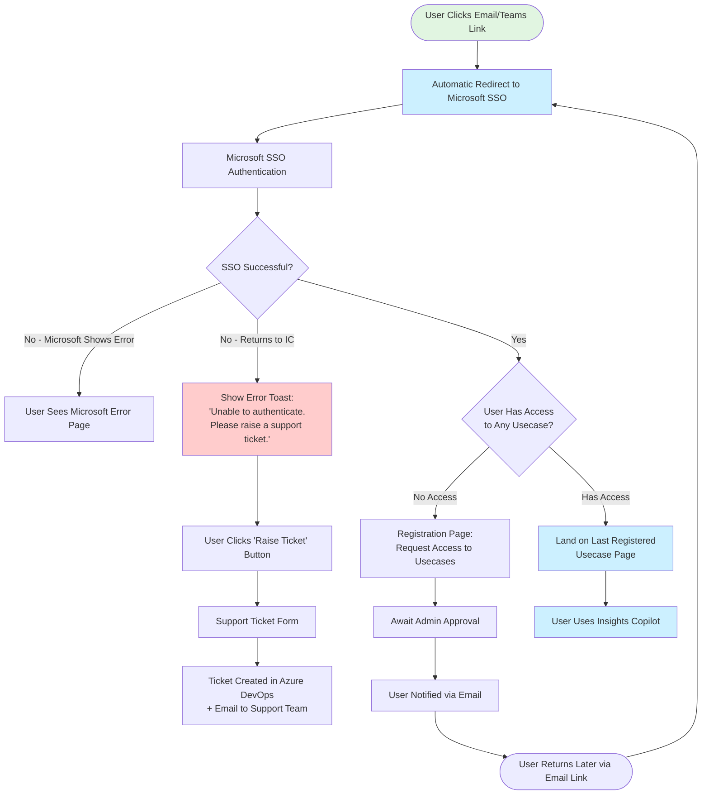
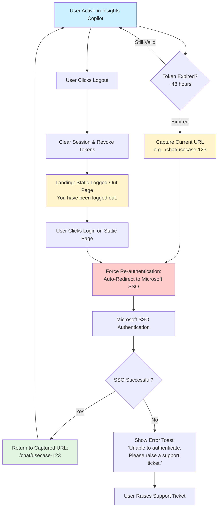

# PRD: Automatic SSO Redirect for Security Compliance

**Created:** January 14, 2026  
**Owner:** Product Team  
**Status:** Draft - Awaiting Approval  
**Timeline:** 1 month to implementation

---

## Overview

### Problem
The current Insights Copilot login page serves as a public entry point that is susceptible to DDoS attacks and other security vulnerabilities. The cybersecurity team has mandated that we either:
1. Implement automatic Microsoft SSO redirect to eliminate the public login page, OR
2. Move Insights Copilot to the company Intranet (restricting access and impacting ~80% of current users)

The public login page requires users to manually click a "Login" button before SSO authentication begins, creating an exposed endpoint that can be targeted by automated attacks without any authentication barrier.

### Solution
Implement automatic Microsoft SSO redirect for all unauthenticated users accessing Insights Copilot. When users hit any route (`/login`, `/home`, `/chat`, or return after session expiration), they will be immediately redirected to Microsoft SSO authentication instead of seeing a login page with a manual button.

**Key Components:**
- **Automatic redirect** on unauthenticated access (no manual "Login" button click required)
- **Deep link preservation** to return users to their intended destination after authentication
- **Fallback mechanism** when Microsoft SSO fails (error toast + support ticket creation via Azure DevOps)
- **No infinite redirect loops** through proper SSO callback detection

### Why Now
- **Cybersecurity mandate:** 1-month deadline to implement or face Intranet isolation
- **Security risk mitigation:** Public login page is vulnerable to DDoS and automated attacks
- **User experience improvement:** Reduces login friction from 30-60 seconds to ~5-10 seconds (eliminating manual button click)
- **Compliance requirement:** Align with AB InBev security standards for enterprise applications

### Success Metrics

**Primary Metrics:**
- **100% auto-redirect adoption** - All unauthenticated access triggers SSO redirect (no manual login button)
- **Zero infinite redirect loops** - No users stuck in redirect cycles
- **<2% SSO fallback rate** - Less than 2% of sessions require support ticket due to SSO failure
- **Maintained 48hr session behavior** - Token expiration logic unchanged

**Secondary Metrics:**
- **Reduced login time** - Target 40% reduction in time-to-authenticated-session (30-60s → 15-35s)
- **Cybersecurity sign-off achieved** - Compliance approval within 1-month deadline
- **Preserved onboarding completion rate** - No degradation in current registration flow completion
- **<10 support tickets/week** - Low fallback system usage during normal Microsoft SSO uptime

---

## Context

### Background
Insights Copilot currently uses Microsoft SSO for authentication, but requires users to:
1. Land on a public login page
2. Click a "Login" button manually
3. Then redirect to Microsoft SSO

This two-step process creates a **public-facing login page that can be targeted** by:
- **DDoS attacks** overwhelming the server with login page requests
- **Credential stuffing attempts** testing username/password combinations
- **Automated scraping/reconnaissance** gathering system information
- **Brute force attacks** on the login endpoint

The cybersecurity team has identified this as a **critical vulnerability** and mandated remediation within 1 month.

### Current State

#### Current Login Flow
```
User Entry → Login Page (PUBLIC) → User Clicks "Login" → Microsoft SSO → 
Access Check → Landing Page (Last Accessed/Registered Usecase)
```

#### Session Management
- **48-hour token expiration** - After ~48hrs of authenticated session, token expires
- **Force re-authentication** - Users redirected back to login page on token expiry
- **Deep link handling** - Existing mechanism preserves intended destination (e.g., `/chat/usecase-123`)

#### Entry Points
1. **Email/Teams links** - Users click Insights Copilot links from communications
2. **Admin direct registration** - Welcome email with access link (still goes through login)
3. **Bookmark/direct navigation** - Users navigate to `/home`, `/chat`, or `/login` directly
4. **Session expiration** - Active users forced to re-authenticate after 48 hours

#### Current Pain Points
- **~80% user drop-off within a week** (onboarding/retention issue)
- **60% drop-off in onboarding funnel**
- **Manual login friction** - Users must consciously click "Login" button
- **Public attack surface** - Login page accessible without any authentication

### Strategic Alignment

**Company Security Standards:**
- Align with AB InBev's zero-trust security model
- Eliminate public-facing authentication endpoints
- Shift security boundary to Microsoft's enterprise SSO infrastructure

**Product Strategy:**
- **Avoid Intranet isolation** - Moving to Intranet would restrict access and worsen existing 80% drop-off rate
- **Improve activation** - Reduce login friction to support activation improvements
- **Enterprise compliance** - Meet security standards required for enterprise tools
- **Scalability** - Prepare for increased usage without security risk

---

## User Research

### Who
**All AB InBev employees accessing Insights Copilot:**
- **Primary users:** Business analysts, data teams, decision-makers across functions
- **User base size:** All AB InBev employees with SSO access
- **Access pattern:** Email/Teams links, bookmarks, direct navigation
- **Session behavior:** 48-hour token lifecycle, multiple re-authentication cycles per week

**Affected user segments:**
- **First-time users** - Landing on login page for initial registration
- **Returning users** - Re-authenticating after session expiration
- **Power users** - Frequent access throughout the day (minimal impact from 48hr token)
- **Infrequent users** - Likely to hit session expiration on every return visit

### Pain Points

#### Current Login Experience
**Manual button click friction:**
- Users land on login page → must consciously click "Login" → wait for SSO redirect
- **Time cost:** 30-60 seconds from landing to authenticated session (varies if already logged into Microsoft browser session)
- **Cognitive load:** Extra decision point ("Should I log in now or check something first?")

**Session expiration disruption:**
- Users mid-workflow suddenly redirected to login page after 48 hours
- Must click "Login" again and re-authenticate
- **Context switching:** Interrupts task flow with manual action required

**No clarity on SSO failures:**
- If Microsoft SSO fails, users returned to login page with unclear error state
- Current error handling doesn't provide clear next steps

#### Security Team Pain Points
- **Public attack surface:** Login page responds to unauthenticated requests (DDoS vulnerability)
- **Compliance risk:** Public authentication endpoints violate zero-trust security principles
- **Limited defense options:** Rate limiting and WAF don't eliminate fundamental exposure
- **Regulatory pressure:** 1-month deadline to remediate or force Intranet isolation

### Evidence

**Quantitative Data:**
- **Login time:** 30-60 seconds average from landing to authenticated session
- **No data available:** SSO failure rate, session expiration frequency, Microsoft SSO downtime impact

**Qualitative Feedback:**
- **Cybersecurity mandate:** "Public login page must be eliminated within 1 month or application moves to Intranet"
- **User behavior:** Existing deep link handling suggests users share and bookmark specific Insights Copilot pages
- **Microsoft SSO reliability:** Rare downtimes reported (no specific metrics available)

**Assumptions to Validate:**
- Users are already familiar with SSO auto-redirect patterns from other AB InBev tools
- Removing manual "Login" button won't confuse users (standard pattern in enterprise SaaS)
- Current 30-60s login time includes manual button click delay (5-10s minimum)

---

## Solution Design

### Core Experience

#### Proposed Login Flow
```
User Entry (Any Route) → AUTO-REDIRECT to Microsoft SSO → 
Access Check → Landing Page (Deep Link Preserved)
```

**Key Changes:**
1. **Remove public login page with manual button** - Replaced with automatic redirect
2. **Immediate SSO redirect** on unauthenticated access
3. **SSO failure fallback** - Error toast + support ticket system
4. **Everything else unchanged** - Access checks, registration flow, landing page logic, 48hr token expiration

#### User Journey: First-Time User



#### User Journey: Returning User (Session Expired)



### Key Features

#### Feature 1: Automatic SSO Redirect
**Description:** Remove public login page and manual "Login" button. All unauthenticated access immediately redirects to Microsoft SSO.

**User Experience:**
- User navigates to `/login`, `/home`, `/chat`, or any protected route
- If not authenticated → instant redirect to Microsoft SSO (no login page shown)
- If authenticated → proceed to requested page

**Technical Implementation:**
- Frontend route guard detects unauthenticated state
- Trigger redirect to Microsoft SSO with return URL parameter
- No visible login page or manual action required

**Success Criteria:**
- 100% of unauthenticated access triggers auto-redirect
- Zero instances of login page shown to unauthenticated users

---

#### Feature 2: Deep Link Preservation
**Description:** Maintain existing mechanism to return users to their intended destination after SSO authentication.

**User Experience:**
- User clicks link to `/chat/usecase-123`
- Redirected to Microsoft SSO
- After successful authentication → returns to `/chat/usecase-123` (not homepage)

**Current Behavior:** Already implemented (preserve this)
- URL captured before SSO redirect
- Return URL passed to SSO callback
- User lands on intended page after authentication

**Success Criteria:**
- 100% of deep links preserved through SSO flow
- User returns to exact URL they originally requested

---

#### Feature 3: SSO Failure Fallback (No Infinite Loops)
**Description:** When Microsoft SSO fails and user returns to Insights Copilot, show error toast with support ticket option instead of re-triggering redirect.

**User Experience:**

**Scenario A - Microsoft Shows Error:**
- User redirected to Microsoft SSO
- Microsoft displays error (e.g., "Authentication failed", "Service unavailable")
- User sees Microsoft's error page → Insights Copilot takes no action

**Scenario B - Silent Failure (User Returns to IC):**
- User redirected to Microsoft SSO
- SSO fails but user returned to Insights Copilot without authentication
- System detects SSO callback without valid token
- Show error toast: **"Unable to authenticate with Microsoft SSO. Please raise a support ticket if this issue persists."**
- Display **"Problem with SSO?"** button in toast

**Fallback Flow:**
1. User clicks "Problem with SSO?" button
2. Opens support ticket form (Contact Admin form)
3. User submits ticket
4. System creates Azure DevOps bug ticket + sends email to support team
5. User receives confirmation: "Ticket #12345 created. Support team will contact you."

**Infinite Loop Prevention:**
- Detect SSO callback failure (no valid token returned)
- Set session flag: `sso_failed = true`
- Do NOT trigger auto-redirect if `sso_failed` flag is set
- Show error toast instead
- Clear flag after successful authentication or manual ticket submission

**Success Criteria:**
- Zero infinite redirect loops in production
- <2% of sessions trigger SSO failure fallback
- 100% of SSO failures result in actionable error message

---

#### Feature 4: Preserved Access Check & Registration Flow
**Description:** All existing logic after authentication remains unchanged.

**Unchanged Behaviors:**
- **Access check:** User with SSO but no usecase access → Registration page
- **Landing page logic:** First-time user → last registered usecase; Returning user → last accessed usecase
- **48hr token expiration:** Session management unchanged
- **Manual logout:** User can still manually end session
- **Registration approval flow:** Admin approval, email notification, return to login (now auto-redirect)

**Success Criteria:**
- Registration flow completion rate maintained (baseline: 40% complete onboarding)
- Landing page logic works identically (users land on correct usecase)
- 48hr token expiration behavior unchanged

---

### Out of Scope

**Explicitly NOT included in this PRD:**

❌ **Alternative authentication methods** - No username/password, no backup auth. Microsoft SSO is the only authentication method (company policy).

❌ **SSO bypass for admins/support** - No backdoor access during Microsoft SSO outages. If Microsoft is down, Insights Copilot is inaccessible (accepted risk).

❌ **Custom SSO error handling** - If Microsoft SSO shows error page, we don't override or customize it. We only handle silent failures that return to Insights Copilot.

❌ **Rate limiting / DDoS protection infrastructure** - This PRD addresses security compliance (remove public login page). Infrastructure-level protections (WAF, Cloudflare) are separate initiatives.

❌ **Session duration changes** - 48hr token expiration remains unchanged. Future optimization of session management is separate.

❌ **Mobile app considerations** - This PRD is for web application only. Mobile app auth flows (if any) are separate.

❌ **Multi-tenant SSO** - Assuming single Microsoft tenant (AB InBev). Multi-org support is out of scope.

❌ **Analytics for SSO failure root causes** - We'll track failure rate but not diagnose Microsoft SSO issues (outside our control).

---

### Open Questions

#### Technical Questions
1. **SSO callback detection:** What specific response indicates SSO failure vs. success? (Token presence, HTTP status code, error parameter in callback URL?)
2. **Session flag storage:** Where is `sso_failed` flag stored? (Session storage, cookie, in-memory state?) What's TTL?
3. **Deep link parameter name:** What URL parameter is currently used to pass return URL to SSO? (e.g., `redirect_uri`, `return_to`)
4. **Ticket form pre-fill:** What error details are captured? (User ID, timestamp, error message, browser info?)

#### Product Questions
5. **Error toast UX:** How long does error toast stay visible? Auto-dismiss or user-dismissed? Positioning on page?
6. **Ticket form location:** Separate modal, inline form, or redirect to dedicated page?
7. **Support team SLA:** What's expected resolution time for SSO-related tickets? Who owns these tickets?

#### Stakeholder Questions
8. **Cybersecurity acceptance criteria:** What specific testing/validation does cybersecurity team require before sign-off?
9. **Rollback plan:** If auto-redirect causes unforeseen issues in production, what's the rollback strategy? Feature flag to restore login page?
10. **Communication plan:** How do we inform users of the change? (Probably transparent to users, but stakeholders need comms?)

---

## Technical Approach

### Architecture

#### Frontend Changes (React Web App)

**Route Guard Modification:**
```typescript
// Current behavior
RouteGuard checks authentication
  → If not authenticated: Render login page with "Login" button
  → User clicks button: Redirect to Microsoft SSO

// New behavior
RouteGuard checks authentication
  → If not authenticated AND sso_failed=false: Immediate redirect to Microsoft SSO
  → If not authenticated AND sso_failed=true: Show error toast with "Problem with SSO?"
  → If authenticated: Render protected route
```

**Components to Modify:**
- **Route guards** - Add auto-redirect logic before rendering login page
- **SSO callback handler** - Detect failure, set `sso_failed` flag
- **Error toast component** - New design for SSO failure message
- **Support ticket form** - New component or link to Azure DevOps integration

**Components to Remove:**
- **Login page with "Login" button** - No longer rendered for unauthenticated users

---

#### Backend Changes (FastAPI)

**Middleware Updates:**
```python
# Current behavior
Unauthenticated request → Return 401 → Frontend shows login page

# New behavior
Unauthenticated request → Return 302 redirect to Microsoft SSO
  → Include return_url parameter for deep link preservation
  → Handle SSO callback, validate token
  → If token invalid: Set sso_failed cookie/header
```

**New Endpoints:**
- **POST `/api/support/ticket`** - Create Azure DevOps ticket + send support email
  - Input: User ID, error message, timestamp, browser info
  - Output: Ticket number, confirmation message

**Modified Endpoints:**
- **SSO callback endpoint** - Add failure detection logic
  - Check for valid token in callback
  - If invalid: Set `sso_failed` flag, redirect to app with error state
  - If valid: Clear any existing `sso_failed` flag, proceed with normal flow

---

#### Authentication Flow Changes

**Before (Current):**
```
1. User → GET /home (unauthenticated)
2. Backend → 401 Unauthorized
3. Frontend → Renders login page
4. User clicks "Login" button
5. Frontend → Redirect to Microsoft SSO
6. Microsoft SSO → Redirect to /callback?code=xyz
7. Backend → Validate code, create session
8. Backend → Redirect to /home
```

**After (Proposed):**
```
1. User → GET /home (unauthenticated)
2. Frontend Route Guard → Check authentication
3. Frontend → Immediate redirect to Microsoft SSO (if sso_failed=false)
4. Microsoft SSO → Redirect to /callback?code=xyz
5. Backend → Validate code, create session
6. Backend → Redirect to /home (deep link preserved)

--- SSO Failure Path ---
4b. Microsoft SSO → Redirect to /callback (no code or invalid code)
5b. Backend → Detect failure, set sso_failed=true
6b. Backend → Redirect to /home with error flag
7b. Frontend → Detect sso_failed, show error toast
8b. User clicks "Problem with SSO?" → Opens support ticket form
9b. Submit ticket → POST /api/support/ticket → Azure DevOps + Email
```

---

### Dependencies

#### Internal Dependencies
1. **Existing Microsoft SSO integration** - Azure AD configuration must remain stable
2. **Deep link mechanism** - Current return URL handling (already implemented)
3. **Azure DevOps API** - For ticket creation (assuming existing integration or new requirement)
4. **Email service** - For support team notifications (likely existing email infrastructure)
5. **Session management** - 48hr token expiration logic (unchanged)

#### External Dependencies
1. **Microsoft Azure AD SSO** - Uptime and availability (outside our control)
   - Risk: Regional outages → entire app inaccessible
   - Mitigation: Accept as known risk, communicate clearly to users
2. **Azure DevOps API** - For ticket creation
   - Risk: API downtime → users can't raise tickets
   - Mitigation: Email-only fallback if DevOps API fails
3. **Browser behavior** - Redirect handling, session storage, cookies
   - Risk: Privacy-focused browsers blocking redirects
   - Mitigation: Detect and show clear error message

---

### Risks

#### High-Priority Risks

**Risk 1: Infinite Redirect Loops**
- **Scenario:** SSO callback fails but doesn't set `sso_failed` flag → Frontend detects unauthenticated → Redirects to SSO again → Loop
- **Impact:** Users completely unable to access application
- **Mitigation:** 
  - Rigorous failure detection in SSO callback handler
  - Set `sso_failed` flag in multiple failure scenarios (no code, invalid code, token validation failure)
  - Add redirect counter (if >2 redirects in 60 seconds → force error state)
  - Extensive testing of edge cases

**Risk 2: Microsoft SSO Downtime = App Inaccessible**
- **Scenario:** Microsoft experiences regional or global SSO outage → No authentication possible → Entire app unusable
- **Impact:** All users locked out during Microsoft outage (rare but high-impact)
- **Mitigation:**
  - Accept as known risk (company policy: SSO-only authentication)
  - Communicate clearly to users: "Microsoft SSO unavailable. Raise support ticket for assistance."
  - Monitor Microsoft SSO status dashboard
  - No technical mitigation (no backup auth allowed)

**Risk 3: Deep Link Loss in Edge Cases**
- **Scenario:** Complex query parameters or URL fragments lost during SSO redirect
- **Impact:** User doesn't return to intended page (e.g., loses filter state, selected usecase)
- **Mitigation:**
  - Test comprehensive URL patterns (query params, fragments, encoded characters)
  - Validate existing deep link mechanism handles all cases
  - Add logging for return URL mismatches

---

#### Medium-Priority Risks

**Risk 4: Support Ticket System Overload**
- **Scenario:** Microsoft SSO regional outage → Hundreds of users try to raise tickets simultaneously
- **Impact:** Azure DevOps API overwhelmed, email flooding support team
- **Mitigation:**
  - Rate limit ticket creation (1 ticket per user per hour)
  - Queue ticket requests if Azure DevOps API slow
  - Add messaging: "We're aware of Microsoft SSO issues. You'll be notified when resolved."

**Risk 5: User Confusion (No Visible Login Page)**
- **Scenario:** Users expect to see a login page, get immediately redirected, feel disoriented
- **Impact:** Perceived as "broken" or "aggressive redirect"
- **Mitigation:**
  - Add loading state: "Redirecting to Microsoft SSO..." (brief, 0.5s delay)
  - User testing with 10-20 internal users before rollout
  - Monitor support tickets for "weird redirect" complaints

**Risk 6: Browser Extensions/Privacy Tools Block Redirects**
- **Scenario:** Privacy-focused browsers or ad blockers prevent automatic redirect
- **Impact:** Users stuck on blank page or see redirect blocked message
- **Mitigation:**
  - Detect redirect failure, show manual link: "Click here to authenticate with Microsoft SSO"
  - Provide troubleshooting guide for common browser extensions

---

#### Low-Priority Risks

**Risk 7: Ticket Spam / Abuse**
- **Scenario:** Users spam "Problem with SSO?" button or automated scripts target ticket endpoint
- **Impact:** Support team overwhelmed with duplicate/fake tickets
- **Mitigation:**
  - Rate limit: 1 ticket per user per hour
  - Require user authentication (if possible) before ticket creation
  - Add CAPTCHA if spam becomes issue

**Risk 8: Session Flag Persistence Issues**
- **Scenario:** `sso_failed` flag persists incorrectly (e.g., not cleared after successful login)
- **Impact:** Users stuck in error state even after SSO recovers
- **Mitigation:**
  - Set short TTL on flag (5-10 minutes)
  - Clear flag on any successful authentication
  - Add manual "Try Again" button to clear flag and retry SSO

---

### Alternatives Considered

#### Alternative 1: Keep Login Page, Add Rate Limiting
**Description:** Keep public login page with manual button, but add aggressive rate limiting and WAF to prevent DDoS.

**Pros:**
- No UX change for users
- Lower implementation risk
- Fallback manual auth option

**Cons:**
- ❌ Doesn't satisfy cybersecurity mandate (public endpoint still exists)
- ❌ Rate limiting can block legitimate users during traffic spikes
- ❌ Doesn't fully eliminate attack surface

**Decision:** Rejected. Cybersecurity team requires public endpoint elimination, not just protection.

---

#### Alternative 2: Move to Intranet (Cybersecurity Fallback Option)
**Description:** Host Insights Copilot on internal Intranet, accessible only via VPN/corporate network.

**Pros:**
- Complete elimination of public access
- Satisfies cybersecurity requirement
- No auth flow changes needed

**Cons:**
- ❌ Restricts access for remote/hybrid users
- ❌ Exacerbates existing 80% drop-off rate (adds VPN friction)
- ❌ Limits scalability and adoption
- ❌ Doesn't align with modern cloud-first strategy

**Decision:** Rejected. This is the consequence of NOT implementing SSO redirect within 1 month. We're avoiding this outcome.

---

#### Alternative 3: Optional Auto-Redirect (User Preference)
**Description:** Let users choose: Auto-redirect to SSO OR show login page with manual button.

**Pros:**
- User control/flexibility
- Accommodates users who want to verify account context

**Cons:**
- ❌ Doesn't eliminate public login page (cybersecurity requirement not met)
- ❌ Adds complexity (user preferences, UI for toggle)
- ❌ Split user base creates support burden

**Decision:** Rejected. Doesn't solve the core security problem.

---

#### Alternative 4: API-Only Auth (No Web Login)
**Description:** Remove web-based login entirely. Users authenticate via API/CLI only.

**Pros:**
- Complete elimination of web login page

**Cons:**
- ❌ Breaks existing user workflows (email/Teams links)
- ❌ Requires users to install CLI tools
- ❌ Not feasible for business users (non-technical)

**Decision:** Rejected. Not aligned with user needs or product strategy.

---

#### Alternative 5: Cloudflare Bot Protection + Keep Login Page
**Description:** Use Cloudflare's bot management to protect login page from automated attacks, keep manual login flow.

**Pros:**
- No auth flow changes
- Industry-standard DDoS protection

**Cons:**
- ❌ Public endpoint still exists (doesn't satisfy cybersecurity mandate)
- ❌ Adds cost (Cloudflare Enterprise tier)
- ❌ Can introduce CAPTCHA friction for legitimate users

**Decision:** Rejected. Cybersecurity team requires endpoint elimination, not just protection.

---

## Go-to-Market

### Launch Plan

#### Phase 1: Internal Pilot (Week 1)
**Audience:** Product team + Engineering team (10-15 users)

**Objectives:**
- Validate auto-redirect works across all entry points
- Test SSO failure fallback (simulate failures)
- Verify deep link preservation
- Confirm zero infinite redirect loops

**Success Criteria:**
- 100% successful redirects in normal flow
- SSO failure fallback tested and working
- Zero redirect loops observed
- Deep links preserved in 100% of test cases

**Rollback Trigger:**
- >1 infinite redirect loop
- >10% redirect failures
- Deep links broken in any scenario

---

#### Phase 2: Staged Rollout (Week 2-3)
**Rollout Schedule:**
- **Week 2, Day 1-2:** 25% of users (random sampling)
- **Week 2, Day 3-5:** 50% of users
- **Week 3, Day 1-3:** 75% of users
- **Week 3, Day 4-7:** 100% of users

**Monitoring:**
- Dashboard tracking redirect success rate per cohort
- SSO failure rate
- Support ticket volume
- Deep link preservation rate
- Session expiration behavior

**Rollback Triggers (per cohort):**
- >5% redirect failures
- >3% SSO fallback ticket rate
- User reports of infinite loops
- >20 support tickets related to auth issues

**Feature Flag:**
- Use feature flag to control rollout percentage
- Allow instant rollback to login page if critical issues

---

#### Phase 3: Full Deployment + Cybersecurity Sign-Off (Week 4)
**Activities:**
1. 100% user rollout complete
2. Monitor for 3-5 days at full scale
3. Present metrics to cybersecurity team
4. Demonstrate public login page removal
5. Obtain formal sign-off

**Cybersecurity Review Checklist:**
- [ ] Public login page no longer accessible to unauthenticated users
- [ ] All entry points trigger automatic SSO redirect
- [ ] No infinite redirect loops in production
- [ ] Fallback mechanism functional (tested with simulated SSO failures)
- [ ] Deep link preservation verified
- [ ] Support ticket system operational

**Final Approval:**
- Engineering lead sign-off (technical implementation)
- UX lead sign-off (user experience validated)
- Product leadership sign-off (metrics acceptable)
- Cybersecurity team sign-off (compliance requirement met)

---

### Rollout Strategy

**Phased rollout with feature flag control** - Minimize risk by gradually increasing user exposure while monitoring metrics.

**Rollout Mechanism:**
- Feature flag: `auto_sso_redirect_enabled` (default: false)
- Cohort-based rollout (random % of users)
- Instant rollback capability if issues detected

**Monitoring Dashboard (Real-Time):**
- Total redirect attempts
- Successful redirects (%)
- SSO callback failures (%)
- Fallback ticket creation rate
- Deep link preservation success (%)
- Support ticket volume (auth-related)
- Average time-to-authenticated-session

**Communication Plan:**

**Internal Stakeholders:**
- Engineering team: Technical implementation details, monitoring plan
- Support team: Train on new error flow, ticket handling process
- Product leadership: Weekly progress updates during rollout

**External Users:**
- No communication needed (transparent UX change)
- Support docs updated: Remove "Click Login button" step from guides
- If issues arise: Email communication explaining temporary SSO authentication behavior

---

### Success Criteria

#### Must-Have (Go/No-Go for Full Rollout)
✅ **Zero infinite redirect loops** - No users stuck in redirect cycle
✅ **>98% successful redirects** - <2% require fallback ticket system
✅ **100% deep link preservation** - Users return to intended page after SSO
✅ **Cybersecurity sign-off** - Formal approval that compliance requirement is met

#### Target Performance
✅ **Reduced login time** - 40% improvement (30-60s → 15-35s average)
✅ **<10 support tickets/week** - Low fallback system usage
✅ **Maintained onboarding rate** - No degradation in registration flow completion
✅ **48hr session behavior unchanged** - Token expiration works identically

#### Long-Term Monitoring (Post-Launch)
📊 **SSO failure correlation with Microsoft outages** - Track and document
📊 **Support ticket volume trends** - Weekly analysis for patterns
📊 **User activation impact** - Does reduced login friction improve onboarding?
📊 **Session expiration frequency** - Data collection for future optimization

---

### Timeline

**Total Duration:** 4 weeks (1-month deadline)

| Week | Phase | Activities | Deliverables |
|------|-------|------------|--------------|
| **Week 1** | Internal Pilot | - Implement auto-redirect logic<br>- Build SSO failure fallback<br>- Create ticket integration<br>- Pilot test with 10-15 internal users | - Feature complete<br>- Zero bugs in pilot<br>- Internal sign-off |
| **Week 2** | Staged Rollout (25-50%) | - Deploy to 25% users (Day 1-2)<br>- Monitor metrics<br>- Scale to 50% users (Day 3-5)<br>- Fix any issues | - 50% rollout complete<br>- Metrics dashboard<br>- Issue log |
| **Week 3** | Staged Rollout (75-100%) | - Scale to 75% users (Day 1-3)<br>- Monitor at scale<br>- Deploy to 100% (Day 4-7)<br>- Full production monitoring | - 100% rollout complete<br>- Final metrics report |
| **Week 4** | Validation & Sign-Off | - Monitor full production (3-5 days)<br>- Compile evidence for cybersecurity<br>- Present to stakeholders<br>- Obtain formal approvals | - Cybersecurity sign-off<br>- Stakeholder approvals<br>- Public login page removed |

**Key Milestones:**
- **Day 7:** Pilot complete, staged rollout begins
- **Day 14:** 50% of users on new flow, no critical issues
- **Day 21:** 100% rollout complete
- **Day 28:** Cybersecurity sign-off obtained, compliance requirement met

---

## Appendix

### Research Artifacts

**Current Login Flow Diagram:**
- [Current login flow with manual button](../context/user-research.md)

**User Research:**
- [Product overview and user pain points](../context/product-overview.md)
- 80% user drop-off within 1 week
- 60% onboarding funnel drop-off

**Technical Context:**
- React frontend, FastAPI backend
- Azure AD Microsoft SSO integration
- Postgres + Redis for session management

---

### Design Mocks

**To be created (pending UX design):**
- [ ] Error toast design (SSO failure message)
- [ ] Support ticket form mockup
- [ ] Loading state for redirect ("Redirecting to Microsoft SSO...")

---

### Technical Specs

**To be documented by Engineering:**
- [ ] SSO callback handler implementation
- [ ] `sso_failed` flag storage mechanism (cookie vs. session storage)
- [ ] Azure DevOps API integration for ticket creation
- [ ] Feature flag configuration (`auto_sso_redirect_enabled`)
- [ ] Deep link parameter handling (existing mechanism documentation)

---

### Open Action Items

**Product:**
- [ ] Finalize error toast UX design
- [ ] Define support ticket SLA with support team
- [ ] Prepare rollout communication plan

**Engineering:**
- [ ] Implement auto-redirect logic (frontend route guard)
- [ ] Build SSO failure detection (backend callback handler)
- [ ] Integrate Azure DevOps ticket API
- [ ] Set up monitoring dashboard
- [ ] Create feature flag for rollout control

**UX:**
- [ ] Design error toast component
- [ ] Design support ticket form
- [ ] Update user guides (remove "Click Login" step)

**Stakeholders:**
- [ ] Review PRD with Engineering, UX, Product Leadership
- [ ] Schedule cybersecurity review for Week 4
- [ ] Prepare evidence package for compliance sign-off

---

### Approval Signatures

**Pending Approval:**
- [ ] Engineering Lead: _____________________ Date: _____
- [ ] UX Lead: _____________________ Date: _____
- [ ] Product Leadership: _____________________ Date: _____
- [ ] Cybersecurity Team (Sign-Off): _____________________ Date: _____

---

**Document Version:** 1.0  
**Last Updated:** January 14, 2026  
**Next Review:** Upon stakeholder feedback
